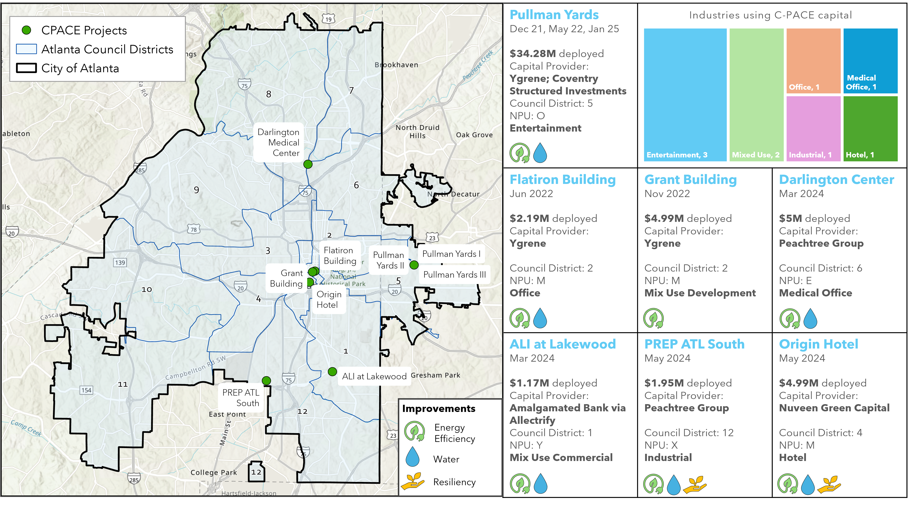

# C-PACE Impact

## Row {height="30%"}

```{r}
#| content: valuebox
#| title: "Capital Deployed"
list(
  icon = "piggy-bank", 
  color = "primary", 
  value = "$54.6 M"
  )
```

```{r}
#| content: valuebox
#| title: "Number of Projects"
list(
  icon = "building-check",
  color = "success",
  value = 9
)
```

```{r}
#| content: valuebox
#| title: "Projected Utility Savings (KBTU/yr)"
list(
  icon = "battery-charging", 
  color = "primary", 
  value = "5.57 M"
  )
```

```{r}
#| content: valuebox
#| title: "Projected emission reductions (MTCO2e/Yr)"
list(
  icon = "plugin", 
  color = "success", 
  value = "644.42"
  )
```

```{r, include = FALSE}

library(tidyverse)
library(dplyr)
library(usethis)
library(devtools)
library(ggplot2)
library(ggtext)
library(ggrepel)
library(ggthemes)
library(extrafont)
library(readxl)
library(rmarkdown)
library(prettydoc)
library(knitr)
library(kableExtra)
library(sf)
library(RefManageR)
library(writexl)
library(shiny)
library(bslib)


plot_theme <- function() {
  font <- "Arial"
  theme_minimal() %+replace%
  theme(
    panel.grid.major = element_blank(),
    panel.grid.minor = element_blank(),
    axis.line = element_line(color = "#28282D", linewidth = 0.3),
    plot.title = element_text(
      family = font,
      size = 20,
      face = "bold",
      hjust = 0,
      vjust = 2),
    plot.subtitle = element_text(
      family = font,
      size = 12,
      hjust = 0),
    axis.title = element_text(
      family = font,
      size = 20),
    axis.text = element_text(
      family = font,
      size = 16) ) 
}

plot_theme2 <- function() {
  font <- "Arial"
  theme_minimal() %+replace%
    theme(
      panel.grid.major = element_line(color = "grey"),
      panel.grid.minor = element_blank(),
      axis.line = element_line(color = "#28282D", linewidth = 0.3),
      plot.title = element_text(
        family = font,
        size = 20,
        face = "bold",
        hjust = 0, 
        vjust = 2),
      plot.subtitle = element_text(
        family = font,
        size = 14,
        hjust = 0),
      axis.title = element_text(
        family = font,
        size = 22),        # Bigger axis title
      axis.text = element_text(
        family = font,
        size = 20),        # Bigger axis labels
      legend.text = element_text(
        family = font,
        size = 20),        # Bigger legend text
      legend.title = element_text(
        family = font,
        size = 20, 
        face = "bold")     # Optional: bold legend title
    )
}
```

```{r}
pace_inv <- data.frame(year = c("2021", "2022", "2023", "2024"), inv = c(3.98, 12.09, 13.11, 25.40))

pace_em_reduction <- data.frame(year = c("2024", "2025"), reduction = c(371.88, 272.54))

pace_en_save <- data.frame(year = c("2022", "2024", "2025"), save = c( 646833.31, 2914630.87, 2008030.00))
```

## Row {height ="70%"}

```{r}
#| title: "PACE Capital Deployed"
paceinv_plot <- ggplot(pace_inv) +
  geom_col(aes(x = year, y = inv, fill = year), color = "#000000", show.legend = FALSE) +
  #ggtitle("PACE Capital Deployed") +
  geom_text(aes(x = year, y = inv, label = paste0(inv, "M")), 
            vjust = -0.5, size = 4, color = "grey", family = "Arial") +
  scale_x_discrete(name = "Year", limits = c("2021", "2022", "2023", "2024")) +
  scale_y_continuous(name = "Capital Deployed ($ Millions)", limits = c(0,30), 
                     expand = c(0,0), labels = scales::comma) +
  scale_fill_manual(values = c("#009ddc", "#009ddc", "#009ddc", "#009ddc")) +
  plot_theme()
paceinv_plot
```

### Column {width="50%"}

```{r}
#| title: "Projected CO2 Emission Reduction (MTCO2e/Yr)"
#| fig-width: 20
#| fig-height: 4
paceemreduction_plot <- ggplot(pace_em_reduction, aes(x = "Total", y = reduction, fill = year)) +
  geom_bar(stat = "identity", width = 0.6) +
  coord_flip() +
  scale_y_continuous(name = "Projected CO2 Emission Reduction (MTCO2e/Yr)", 
                     expand = c(0, 0), labels = scales::comma) +
  scale_x_discrete(name = NULL, labels = NULL) +
  scale_fill_manual(values = c("#c8df8e", "#5e9732")) +
  plot_theme2()
paceemreduction_plot
```

```{r}
#| title: "Projected Energy Savings (kBTU/Yr)"
#| fig-width: 20
#| fig-height: 4
paceensave_plot <- ggplot(pace_en_save, aes(x = "Total", y = save, fill = year)) +
  geom_bar(stat = "identity", width = 0.6) +
  coord_flip() +
  scale_y_continuous(name = "Projected Energy Savings (kBTU/Yr)", 
                     expand = c(0, 0), labels = scales::comma) +
  scale_x_discrete(name = NULL, labels = NULL) +
  scale_fill_manual(values = c("#a2d4f4", "#3d9cdb","#002d56")) +
  plot_theme2()
paceensave_plot
```

# Project wise Breakdown

## Row {height="100%"}

{fig-align="center"}


